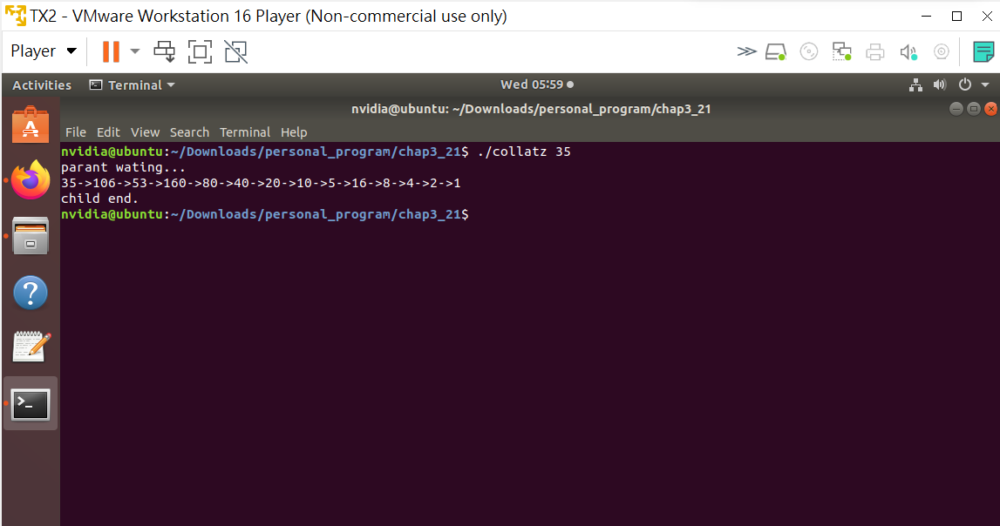

# Programming Problems 1110590450 歐佳昀

this command for compile

```
gcc <filename> -o <ouput file name>
```

## Chap. 2

- 2.24\*: In Sec.2.3, we described a program that copies the contents of one file to a destination file.

  - This program works by first prompting the user for the name of the source and destination files.

- Write this program using either POSIX or Windows API.

  - Be sure to include all necessary error checking, including ensuring that the source file exists.

- Once you have correctly designed and tested the program, if you used a system that supports it, run the program using a utility that traces system calls. (Assume the name of the executable file is FileCopy)

  - Linux systems provide the strace utility
    (strace ./FileCopy)

  - Solaris and Mac OS X systems use the dtrace command
    (sudo dtrace ./FileCopy)
    As Windows systems do not provide such features, you will have to trace through the Windows version of this program using a debugger.

```
./FileCopy
```


or use this command to strace

```
strace ./FileCopycle
```


## Chap. 3

- 3.19\*: Write a C program called time.c that determines the amount of time necessary to run a command from the command line.

- This program will be run as "./time <command>" and will report the amount of elapsed time to run the specified command.
- This will involve using fork() and exec() functions, as well as the gettimeofday() function to determine the elapsed time.
- It will also require the use of two different IPC mechanisms.

- The first version will have the child process write the starting time to a region of shared memory before it calls exec().
  - After the child process terminates, the parent will read the starting time from shared memory.
  - Refer to Section 3.7.1 for details using POSIX shared memory.
- The second version will use a pipe.

  - The child will write the starting time to the pipe, and the parent will read from it following the termination of the child process.

version 1

```
./time_shm <command>
```


version 2

```
./time_pipe <command>
```


<br>
<br>

- [optional] (3.21\*\*): The Collatz conjecture concerns what happens when we take any positive integer n and apply the following algorithm:

      n= n/2, if n is even
      n= 3*n+1, if n is odd

  The conjecture states that when this algorithm is continually applied, all positive integers will eventually reach 1.For example, if n=35, the sequence is: 35, 106, 53, 160, 80, 40, 20, 10, 5, 16, 8, 4, 2, 1.

- Write a C program using the fork() system call that generates this sequence in the child process. The starting number will be provided from the command line.
  - For example, if 8 is passed as a parameter on the command line, the child process will output 8, 4, 2, 1.
- Because the parent and child processes have their own copies of the data, it will be necessary for the child to output the sequence.
- Have the parent invoke the wait() call to wait for the child process to complete before exiting the program.
- Perform necessary error checking to ensure that a positive integer is passed on the command line.

```
./collatz <parameter>
```


<br>
<br>

- [optional] (3.27\*\*): Design a file-copying program named filecopy using ordinary pipes.

  - This program will be passed two parameters: the name of the file to be copied, and the name of the copied file
  - The program will then create an ordinary pipe and write the contents of the file to be copied to the pipe
  - The child process will read this file from the pipe and write it to the destination file

- For example, if we invoke the program as follows:
  filecopy input.txt copy.txt
  - The file input.txt will be written to the pipe. The child process will read the contents of this file and write it to the destination file copy.txt.
- You may write this program using either UNIX or Windows pipes.

```
./file input.txt <copy file name>
```


