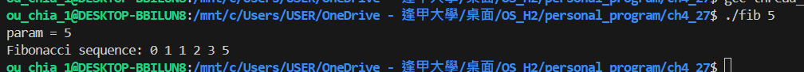
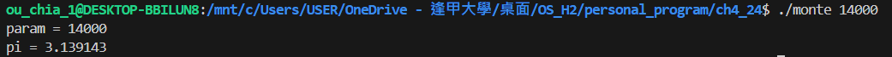
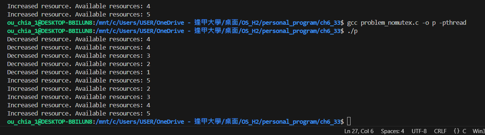
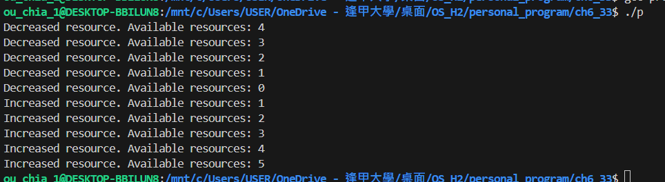
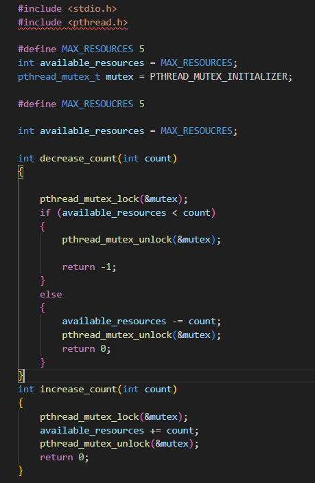

# Programming Problems 1110590450 歐佳昀

this command for compile

```
gcc <filename> -o <ouput file name>

```

with thread

```
gcc <filename> -o <ouput file name> -pthread
```

or can use

```
make
```

and clean output

```
make clean
```

## Chap. 4

- 4.27\*: The Fibonacci sequence is the series of numbers 0, 1, 1, 2, 3, 5, 8, … . Formally, it can be expressed as

  fib0 = 0

  fib1 = 1

  fibn = fibn-1 + fibn-2

- Write a multithreaded program that generates the Fibonacci sequence using either the Java, Pthread, or Win32 thread library.

- This program should work as follows:

  - On the command line, the user will enter the number of Fibonacci numbers that the program is to generate
  - The program will then create a separate thread that will generate the Fibonacci numbers, placing the sequence in data that can be shared by the threads (an array is probably the most convenient data structure)
  - When the thread finishes execution, the parent thread will output the sequence generated by the child thread
  - Because the parent thread cannot begin outputting until the child finishes, the parent will have to wait for the child thread to finish
    ```
    ./fib.out
    ```
    

---

- [optional] (4.24\*\*): An interesting way of calculating pi is to use a technique known as Monte Carlo, which involves randomization. This technique works as follows:

- Suppose you have a circle inscribed within a square, (Assume that the radius of this circle is 1.)
- First, generate a series of random points as simple (x,y) coordinates
- These points must fall within the Cartesian coordinates that bound the square
- Of the total number of random points that are generated, some will occur within the circle
- Next, estimate pi by performing the following calculation:
  - Pi=4\*(number of points in circle) / (total number of points)
- Write a multithreaded version of this algorithm that creates a separate thread to generate a number of random points.
  - The thread will count the number of points that occur within the circle and store that result in a global variable.
  - When this thread has exited, the parent thread will calculate and output the estimated value of pi.
  ```
    ./monte.out
  ```
  

## Chap 6.

- 6.33\*: Assume that a finite number of resources of a single resource type must be managed.
  Processes may ask for a number of these resources and will return them once finished.
  - As an example, many commercial software packages provide a given number of licenses, indicating the number of applications that may run concurrently.
  - When the application is started, the license count is decremented.
  - When the application is terminated, the license count is incremented.
  - If all licenses are in use, requests to start the application are denied.
  - Such a request will be granted only when an existing license holder terminates the application and a license is returned.

```
#define MAX_RESOUCRES 5

int available_resources = MAX_RESOUCRES;

int decrease_count(int count)
{
    if (available_resources < count)
        return -1;
    else
    {
        available_resources -= count;
        return 0;
    }
}
int increase_count(int count)
{
    available_resources += count;
    return 0;
}
```

- The preceding program segment produces a race condition. Do the following:

  (a) Identify the data involved in the race condition.

  ```
  available_resources => the data involved in the race condition.
  ```

  (b) Identify the location (or locations) in the code where the race condition occurs.

  ```
  decrease_count => available_resources -= count;
  increase_count => available_resources += count;

  work in the same time, will occur race condition.

  ```

  (c) Using a semaphore or mutex lock, fix the race condition. It is permissible to modify the decrease_count() function so that the calling process is blocked until sufficient resources are available.

```
#include <stdio.h>
#include <pthread.h>

#define MAX_RESOURCES 5
int available_resources = MAX_RESOURCES;
pthread_mutex_t mutex = PTHREAD_MUTEX_INITIALIZER;

int decrease_count(int count)
{

    pthread_mutex_lock(&mutex);

    if (available_resources < count)
    {
        pthread_mutex_unlock(&mutex);

        return -1;
    }
    else
    {
        available_resources -= count;
        pthread_mutex_unlock(&mutex);

        return 0;
    }
}
int increase_count(int count)
{
    pthread_mutex_lock(&mutex);
    available_resources += count;
    printf("Increased resource. Available resources: %d\n", available_resources);
    pthread_mutex_unlock(&mutex);
    return 0;
}

```

without mutex

```
  ./nomutex.out
```



with mutex

```
  ./mutex.out
```



for change


