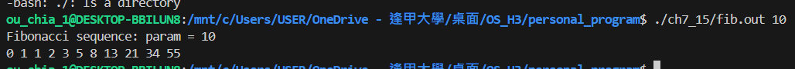
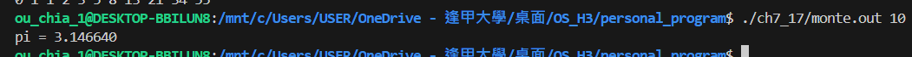
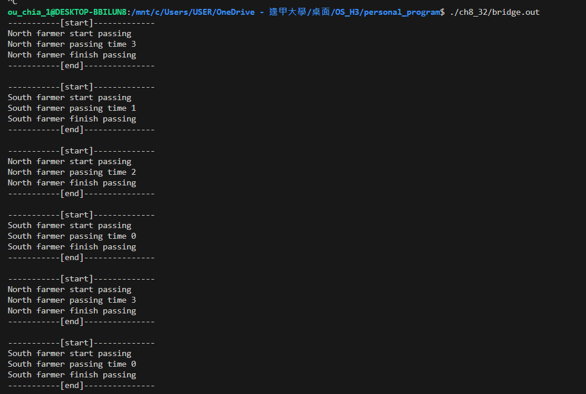
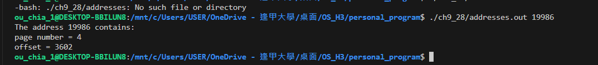

# Programming Problems 1110590450 歐佳昀

this command for compile

```
make
```

and clean output file

```
make clean
```

## chap. 7

- 7.15\*: In Exercise 4.27, you wrote a program to generate the Fibonacci sequence.

  - The program required the parent thread to wait for the child thread to finish its execution before printing out the computed values.
    If we let the parent thread access the Fibonacci numbers as soon as they were computed by the child thread—rather than waiting for the child thread to terminate—what changes would be necessary to the solution for this exercise? Implement your modified solution.

    

- (7.17\*\*): Exercise 4.24 asked you to design a multithreaded program that estimated π using the Monte Carlo technique.

  - In that exercise, you were asked to create a single thread that generated random points, storing the result in a global variable.

  - Once that thread exited, the parent thread performed the calculation that estimated the value of π.
  - Modify that program so that you create several threads, each of which generates random points and determines if the points fall within the circle.
  - Each thread will have to update the global count of all points that fall within the circle.

  - Protect against race conditions on updates to the shared global variable by using mutex locks.
    

- 8.32\*: Implement your solution to Exercise 8.30 using POSIX synchronization.

  - In particular, represent northbound and southbound farmers as separate threads.
  - Once a farmer is on the bridge, the associated thread will sleep for a random period of time, representing traveling across the bridge.
  - Design your program so that you can create several threads representing the northbound and southbound farmers.

    original 8.30 pseudocode

  ```

    semaphore bridge = 1;

    void enterbridge() {
        bridge.wait();
    }
    void exitbridge() {
        bridge.signal();
    }

  ```

  

- 9.28\*: Assume that a system has a 32-bit virtual address with a 4-KB page size. Write a C program that is passed a virtual address (in decimal) on the command line and have it output the page number and offset for the given address.

As an example, your program would run as follows:

```

./addresses.out 19986

```

Your program would output:

```

The address 19986 contains
page number=4
offset=3602

```

Writing this program will require using the appropriate data type to store 32 bits. We encourage you to use unsigned data types as well.


