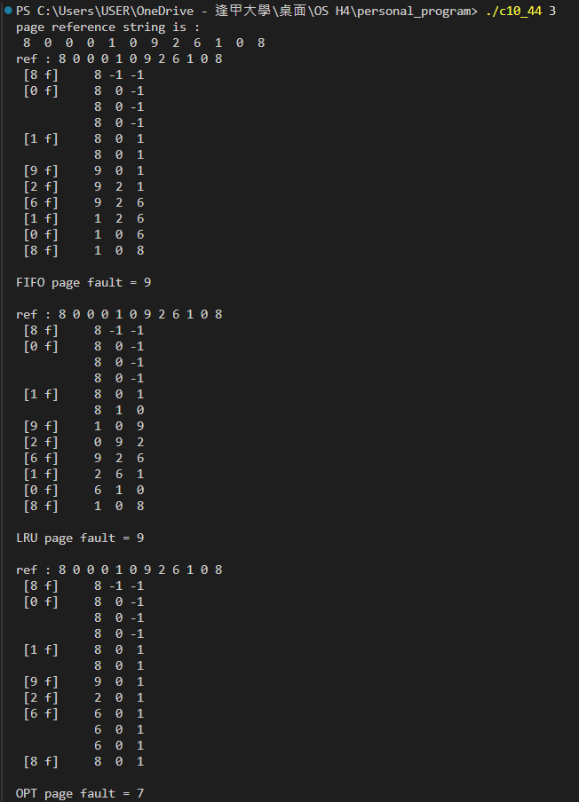
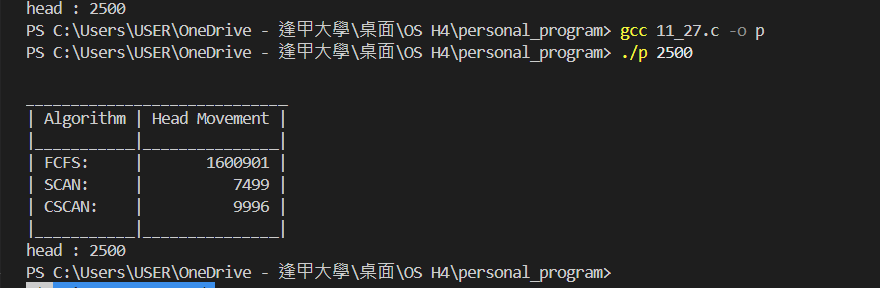

# Programming Problems 1110590450 歐佳昀

```
gcc <filename> -c <output>
```

## chap. 10

- 10.44\*: Write a program that implements the FIFO, LRU, and optimal (OPT) page-replacement algorithms presented in Sec.10.4.

  - Have your program initially generate a random page-reference string where page numbers range from 0 to 9.
  - Apply the random page-reference string to each algorithm, and record the number of page faults incurred by each algorithm.
  - Pass the number of page frames to the program at startup.
  - You may implement this program in any programming language of your choice.

  ```
   ./c10_44 3
  ```

  - (show on next page)

  

## chap. 11

- 11.27\*: Write a program that implements the following disk-scheduling algorithms:

  - (a) FCFS
  - (b) SCAN
  - (c) C-SCAN

  Your program will service a disk with 5,000 cylinders numbered 0 to 4,999.
  The program will generate a random series of 1,000 cylinder requests and service them according to each of the algorithms listed above.
  The program will be passed the initial position of the disk head (as a parameter on the command line) and report the total amount of head movement required by each algorithm.

```
 ./c11_27 2500
```


